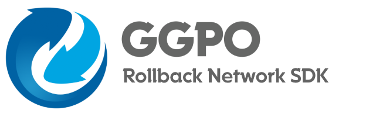

Fork of GGPO with some changes:

1. Bug fixes eg GGPO was not working properly when players chose different input delays.
2. Much improved rift handling.
3. In-game chat.
4. Desync detection.



&nbsp; _[](https://ci.appveyor.com/project/pond3r/ggpo/branch/master)_

(日本語ドキュメントは[こちら](README.ja.md))

### Original fork by thomashenry79: https://github.com/thomashenry79/ggpo-x

### Changes from the linux_crossplatform branch:
1) Some CMake, C and C++ files were modified to make possible compilation up to C17 and C++20.

2) MSVC, GCC (MinGW) and Clang (LLVM) can compile it on Windows.

3) Added two files "mingw_socket.cpp" and "mingw_socket.h" to make possible the project compilation with GCC, and probably on Linux.
They can be found inside /src/lib/ggpo/network.

4) Modified the compilation and linker options for MSVC and added new ones for GCC and Clang, for 32 and 64 bits.
These can be found in /src/cmake.

5) The minimal standards now are C11 and C++14.

6) **"Debug"**, **"Release"** and **"RelWithDebInfo"** build types available.

7) Added several print messages to notice what compiler and options were chosen.

8) Added the "3rd-party" folder under /src to put all necessary SDL2 files. For some reason CMake has trouble
detecting its installation outside of the project's folder.


### Note: GGPO-X on linux is in process.
### To Do: Make vectorwar compile.
### Make vectorwar example work on windows, linux and unix.
### Update README.ja.md

---------------------------------------------------------------------------------------------

## What's GGPO?

Traditional techniques account for network transmission time by adding delay to a players input, resulting in a sluggish, laggy game-feel.  Rollback networking uses input prediction and speculative execution to send player inputs to the game immediately, providing the illusion of a zero-latency network.  Using rollback, the same timings, reactions, visual and audio queues, and muscle memory your players build up playing offline will translate directly online. The GGPO networking SDK is designed to make incorporating rollback networking into new and existing games as easy as possible.

For more information about the history of GGPO, check out http://ggpo.net/

This repository contains the code, documentation, and sample applications for the SDK.

## Building

### Windows with Visual Studio, GCC (MinGW) or Clang (LLVM)

**First of all:** Install [MSYS2](https://www.msys2.org/), you will find several versions of command lines.
Inside the MinGW64 and MinGW32 cmds install the packages "gcc", "cmake" and "make" one by one.
You can do this by typing "pacman -S package-name" without the double quotes. The packages are:

```
MinGW64: mingw-w64-x86_64-gcc, mingw-w64-x86_64-cmake and mingw-w64-x86_64-make.

MinGW32: mingw-w64-i686-gcc, mingw-w64-i686-cmake and mingw-w64-i686-make.
```

---------------------------------------------------------------------------------------------

**Second:** Add the folder C:\msys64\mingw32\bin or C:\msys64\mingw64\bin to the PATH in Environment Variables,
depending on which version you want to use for 32 or 64 bits binaries.

---------------------------------------------------------------------------------------------

Optional: You can also install the Clang official version from [LLVM](https://llvm.org/).

---------------------------------------------------------------------------------------------

**Third:** Now, you have to choose a "generator" that will help you easily create the project files, depending on the compiler of your choice.
Notice that Visual Studio generators are exclusively for MSVC (not to confuse it with Visual Studio Code), MinGW Makefiles allows you to use Clang and GCC (the last one from MinGW version), and Ninja allows the three compilers and it's really fast.

1) Borland Makefiles
2) MSYS Makefiles
3) MinGW Makefiles
4) NMake Makefiles
5) NMake Makefiles JOM
6) Unix Makefiles
7) Watcom WMake

8) Ninja
9) Ninja Multi-Config

10) Visual Studio 14 2015
11) Visual Studio 15 2017
12) Visual Studio 16 2019
13) Visual Studio 17 2022

--------------------------------------------------------------------------------------------

Steps to build GGPO-X with any generator.

```
cd build
cmake -G "<generator of choice>" ../ -DCMAKE_BUILD_TYPE=<build type>
cmake --build .
cmake --install . --config <build type>
```

**Please don't write <> when typing the commands.**

Notes:
1) Vectorwar's compilation was deactivated from the main CMakeLists.txt file, because it cannot be compiled yet.
2) The resulting files will be found at /build/installed.
3) The MinGW version used has POSIX Threads and the MSVCRT runtime, hence why the UCRT version is not recommended.

### Linux

```
$ cd build
$ cmake ..
$ make
```

## Sample Application

The Vector War application in the source directory contains a simple application which uses GGPO to synchronize the two clients.  The command line arguments are:

```
vectorwar.exe  <localport>  <num players> ('local' | <remote ip>:<remote port>) for each player
```

See the .cmd files in the bin directory for examples on how to start 2, 3, and 4 player games.

## Licensing

GGPO-X is available under The MIT License. This means GGPO-X is free for commercial and non-commercial use. Attribution is not required, but appreciated.
